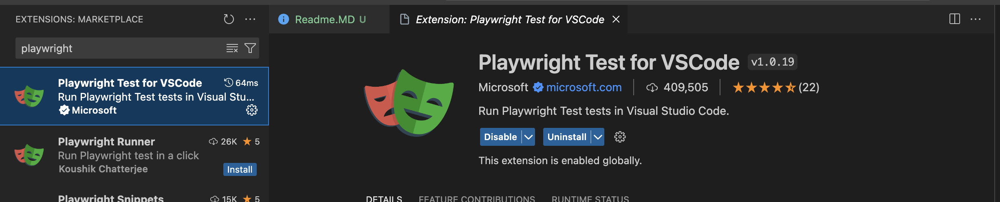

# Playwright web - Spike

## Project Setup

1. Install NodeJS
2. Pick an IDEA -> Visual Studio Code
3. Install initial project dependencies

`npm install`

4. Install VS Code plugin:

* Playwright Test for VSCode

**Good points:**
- Easy to run/re-run test from the Visual Studio Code with headless or with the picked browser
- Easy to debug
- Good results
- Run the test one by one, based on the files or tests

**Bad points:**
- Very rarelly the IDE getting crazy so need to restart the whole Visual Studio Code
- Sometimes hard to find specific information/help on the internet
- Sometimes the documetnation is very vague

### Inside that directory, you can run several commands:

`npx playwright test` - Runs the end-to-end tests.

`npx playwright test --ui` - Starts the interactive UI mode.

`npx playwright test --project=chromium` - Runs the tests only on Desktop Chrome.

`npx playwright test example` - Runs the tests in a specific file.

`npx playwright test --debug` - Runs the tests in debug mode.

`npx playwright codegen` - Auto generate tests with Codegen.

We suggest that you begin by typing:

`npx playwright test`

#### Files
* package.json
  * Node project management file
* playwright.config.js
  * Configuration file
* test folder(e2e)
  * basic example test
* test examples folder
  * detailed example tests
* .gitignore
  * To be used during git commit and push
* playwright.yml 
  * To be used during ci cd pipeline

5. Check playwright added - `npm playwright -v`
6. Check playwright command options - `npx playwright -h `

## Used browser for testing
Webkit - Safari
Firefox - Firefox browser
Chromium - Chrome

## Running tests with different configuration

`npx playwright test` - Runs all tests on all browsers in headless mode

`npx playwright test --workers 3` - Runs with 3 workers in paralell

`npx playwright test one.spec.js` - Runs a specific test file

`npx playwright test one.spec.js two.spec.js` - Runs the file specified

`npx playwright test one two` - Runs files that have "one" or "two" in the file name

`npx playwright test -g "check title"` - Runs test with the title

`npx playwright test --project=chromium` - Runs on specific browser

`npx playwright test --headed` - Runs test in headed mode

`npx playwright test --debug` - Debug tests

`npx playwright test example.spec.js --debug` - Debug specific test file

`npx playwright test example.spec.js:21 --debug` - Debug starting from specific line where test start at the 21.st line

## Run it locally

1. Create a ".env" file with the follow

`TESTUSER_USERNAME = ""`

`TESTUSER_PASSWORD = ""`

`DEV_BASE_URL = ""`

`DEV_TOKEN_URL = ""`

`REVISION_KEY = ""`

## Architecture

### Folders/files:

#### fixtures
Fixed set of data

#### playwright.config.js
Configuration file for browsers and runner

### Approches: